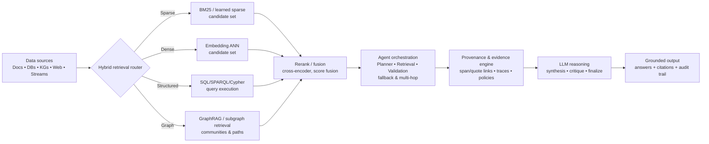

# Retrieval-Augmented Inference and Hybrid Retrieval for LLMs 2023–2026

## Executive summary

Between 2023 and early 2026, retrieval-augmented inference has shifted from “vector-only RAG” toward **multi-stage, hybrid, and agent-mediated retrieval**: combining lexical (sparse) matching, dense embeddings, reranking, query rewriting, structured queries (SQL/SPARQL), and increasingly **graph-structured retrieval** for global reasoning over corpora. Production systems now routinely expose retrieval as a **tool** (not just a pre-processing step), enabling LLMs/agents to decide *when* to retrieve, *what* to retrieve, and *how* to verify the result (e.g., evaluator-triggered fallback to web search or alternate retrieval actions). citeturn8view2turn8view3turn8view10turn8view9turn8view0

For an org that operates its own models, the most persuasive “state of the art” framing is: **modern inference is best modeled as orchestration** across heterogeneous memory systems (files, vector stores, keyword indexes, structured DBs, knowledge graphs, web grounding), plus **provenance and observability standards** that make retrieval-and-generation auditable. citeturn10view2turn8view4turn12view2turn9view2

Practically, this is excellent positioning for a PA‑AKG proposal because the dominant open gaps are not “add retrieval,” but: (i) **robust hybrid retrieval routing**, (ii) **structured/graph grounding that supports multi-hop synthesis**, (iii) **fine-grained evidence linking**, and (iv) **agent validation loops** that detect retrieval failure modes and enforce provenance constraints. citeturn11view1turn8view10turn12view1turn8view4

(Administrative note for your submission workflow: the Amazon–Virginia Tech CFP states the 1‑page abstract is “one-page maximum, excluding references,” so adding a compact references section is typically safe from a page-limit perspective.) fileciteturn0file0

## Retrieval advances beyond classic vector-only RAG

A core 2023–2026 trend is the **unbundling of “retrieval” into a pipeline**: candidate generation (sparse/dense/hybrid), query rewriting, reranking, and retrieval control policies (retrieve/not retrieve, or switch retrievers mid-flight). This addresses a key limitation of naive RAG: retrieving a fixed top‑k from a dense index regardless of query type can degrade factuality when retrieval is noisy, contradictory, or lexically specific. citeturn8view10turn8view9turn8view0turn12view1

**Sparse + dense hybrid retrieval** (BM25/keyword + embeddings) has become a default “production-shaped” baseline because it better handles entity names, IDs, and rare tokens (lexical precision) while still capturing semantic similarity (recall). AWS explicitly characterizes hybrid search as combining keyword and semantic search to “bring the best of both approaches,” and exposes it as a selectable query mode for knowledge-base RAG. citeturn8view0turn8view1turn10view2

**Learned sparse retrieval** advanced materially in this period, with approaches that learn sparse lexical expansions (SPLADE-family) and more recent work that investigates training sparse retrievers using causal LMs as backbones, while still benchmarking against classical BM25 and strong sparse baselines. For a PA‑AKG proposal, this matters because learned sparse retrieval is an “in-between” option: it preserves the inverted-index ergonomics and term-level explainability of sparse retrieval while improving semantic matching. citeturn8view11turn5search11

**Retrieval control and self-correction** became a major line of work. Self‑RAG trains a model to *decide when to retrieve* and to critique its own generations via special “reflection tokens,” targeting factuality and citation quality improvements without always forcing retrieval. citeturn8view9turn0search5  
Corrective RAG (CRAG) explicitly adds a lightweight retrieval evaluator that scores retrieval quality/confidence and triggers different retrieval actions when the initial retrieval is low-quality, emphasizing robustness when retrieval goes wrong. citeturn8view10turn0search14

**Hierarchical / multi-resolution retrieval** (retrieving over summaries as well as leaf chunks) emerged to address “chunk myopia” in long documents. RAPTOR constructs a tree of recursively summarized clusters and retrieves at different abstraction levels; this is directly relevant to PA‑AKG because graphs and hierarchies are complementary strategies to expose global structure to an LLM without flooding context. citeturn8view14turn5search9

**Retrieval as memory** moved from metaphor to systems architecture. MemGPT frames long-term context as a tiered memory system with OS-like “paging” of relevant context into the prompt, highlighting explicit memory tiers and control flow. citeturn8view15turn7search5

## Graph and structured retrieval with knowledge-graph integration

The most visible “beyond vector RAG” development is **graph-shaped retrieval**: using extracted entities/relations to support multi-hop synthesis, community-level summaries, and global queries that baseline top‑k chunk retrieval fails to answer.

Microsoft’s GraphRAG formalizes this by constructing an LLM-derived “knowledge graph” over a private corpus and using it for prompt augmentation aimed at questions requiring cross-document connection (“connect the dots”) and holistic summarization over large collections. citeturn8view8turn11view1turn0search7  
In parallel, G‑Retriever treats graph QA as retrieval over a *textual graph* (nodes/edges have text), using an optimization objective to select relevant subgraphs (a structural analog to selecting passages) to mitigate hallucination and scale beyond context limits. citeturn11view3turn11view2

A second axis is **structured query generation and execution** (SQL/SPARQL/Cypher): rather than retrieving text chunks, the model/agent produces a structured query against a database or knowledge graph, executes it, and then grounds generation on the result. AWS explicitly describes converting natural language into structured queries (e.g., SQL) as a knowledge-base capability, and positions knowledge bases as components to be embedded into agent workflows. citeturn10view2turn10view1  
On the research side, 2025 work on SPARQL generation increasingly incorporates RAG modules and correction layers, reflecting a practical acknowledgement: high-precision structured retrieval often requires both schema grounding (symbolic) and contextual retrieval (neural). citeturn6search1turn6search2turn6search9

For PA‑AKG, the key synthesis is: **graph/structured retrieval turns “retrieval” into a reasoning substrate**. Dense retrieval returns evidence; graph/structured retrieval returns *executable structure* (paths, joins, constraints) that can be validated and traced.

## Provenance and evidence tracking methods and emerging standards

Provenance has two layers in modern RAG systems: (i) **content attribution** (what evidence supports each claim) and (ii) **system traceability** (what retrieval/tool calls happened, in what order, with what parameters).

On content attribution, recent work aims to improve **fine-grained citations**, moving beyond linking to a whole document toward quoting or pinpointing supporting spans. A 2024 Findings of ACL paper emphasizes generating and citing extractive quotes to make verification easier and to improve citation quality metrics, reflecting a broader “attributed LLM” push. citeturn12view1turn6search7  
An important caution from 2025 evidence: even when RAG systems avoid “URL hallucination” by using search access, they can still produce references that do not actually support *all* statements—showing why PA‑AKG should treat “has citations” as necessary but not sufficient. citeturn12view0

On system traceability, **OpenTelemetry** has moved toward standardizing GenAI observability. The OpenTelemetry GenAI semantic conventions define structured signals (traces/metrics/events) and include conventions for **agent spans**, aiming to make tool use and model interactions observable in a vendor- and framework-agnostic way. This is a credible anchor for PA‑AKG’s “provenance engine” claims because it signals alignment with a real standardization trend rather than bespoke logging. citeturn8view4turn12view2turn3search15

## Agent orchestration and tool use as retrieval control

From 2023–2026, retrieval increasingly appears as an **agent tool** rather than a fixed pipeline stage. This matters because: (a) retrieval decisions become conditional (plan-dependent), and (b) provenance can be enforced via orchestrated checkpoints.

Model-provider APIs and docs reflect this tooling shift:

- OpenAI describes a structured “tool calling flow” where the application exposes tools, the model requests calls, the application executes them, and the conversation iterates—i.e., an orchestration loop rather than one-shot prompting. citeturn8view3turn3search5  
- OpenAI’s file search tool explicitly supports **semantic and keyword search** over uploaded corpora, codifying hybrid retrieval as a first-class tool primitive in their API design. citeturn8view2turn4search3  
- AWS Bedrock agents define “action groups” as the unit of capability, specifying parameters, execution logic, and OpenAPI schemas—essentially the contract layer for tool use and orchestration. citeturn10view0turn10view1  
- Anthropic’s engineering guidance highlights scaling pain points when agents connect to many tools: tool definitions and intermediate results can consume context and increase cost/latency, motivating *tool search* and programmatic tool calling patterns that reduce context load. citeturn8view5turn13view0  
- Google’s Vertex AI messaging similarly frames production agents as multi-agent systems requiring orchestration, enterprise data connections, and tool use, while also emphasizing open standards like MCP for tool/data connectivity. citeturn9view0turn9view1

For PA‑AKG, the important analytical point is: **agents turn hybrid retrieval into a policy problem** (routing, fallback, validation), and create a natural place to insert provenance constraints (e.g., “no statement without an evidence link”).

## Efficiency and system-level improvements shaping retrieval-augmented inference

Efficiency advances in this period matter because retrieval competes with—and complements—long-context inference.

**Long context expanded dramatically**, with Google’s Gemini 1.5 report emphasizing evaluation of million-token-scale contexts and “needle-in-a-haystack” style retrieval within long inputs. This reduces the *need* for retrieval in some cases, but does not eliminate it because retrieval still offers freshness, smaller compute footprints, and structured access patterns. citeturn8view16turn2search3  
Anthropic’s 2026 model release notes explicitly describe large-scale “with tools” runs featuring **context compaction** to reach multi‑million-token total processing—suggesting the industry is betting on hybrid strategies: long context *plus* retrieval/tools. citeturn8view17turn8view5

On serving efficiency, the vLLM line of work is central: PagedAttention uses OS-inspired paging to reduce KV-cache fragmentation and enable higher-throughput serving; for retrieval-augmented systems, this translates into more economical multi-step agent loops and increased feasibility of reranking or multi-retriever cascades under latency budgets. citeturn8view13turn5search8turn5search16  
More recent work explores dynamic KV-cache memory management via demand paging (vAttention), underscoring that “memory disaggregation” for LLM inference is increasingly about **treating attention memory like managed virtual memory**—a conceptual parallel to retrieval-as-memory architectures like MemGPT. citeturn5search12turn8view15

System-design patterns that gained traction in production (and are PA‑AKG-relevant) include retrieval caching (query/result reuse), composable retrieval (chaining rerankers and structured retrievers), and reranking as a standard feature—AWS explicitly lists reranking models and citations as knowledge-base capabilities. citeturn10view2turn8view0

## Industry systems and provider features relevant to hybrid retrieval and agents

A concise cross-provider snapshot (publicly documented) illustrates where “hybrid retrieval + agents” is heading:

- AWS: Bedrock Knowledge Bases expose hybrid search and describe citations, reranking, structured-query conversion, and integration into agents—strong evidence that enterprise RAG is already hybrid and workflow-integrated. citeturn8view0turn8view1turn10view2  
- Anthropic: engineering posts emphasize scaling tool ecosystems (Tool Search Tool; programmatic tool calling) and MCP-based patterns to reduce token overhead and improve tool composition, framing agent efficiency as a first-class concern. citeturn8view5turn13view0  
- OpenAI: API docs position file search (semantic + keyword) and tool calling as standard building blocks in the Responses API ecosystem, aligning retrieval with agent loops. citeturn8view2turn8view3  
- Google: Vertex AI provides explicit “grounding with Google Search” and function calling docs, plus public positioning around multi-agent orchestration and open connectivity protocols. citeturn9view2turn9view1turn9view0  
- Meta: Llama’s public API documentation describes tool calling as model-driven choice over available tools, supporting a pattern where retrieval/structured queries are implemented as external tools paired with open models. citeturn3search10turn3search4

This landscape supports a reviewer-friendly claim: **hybrid retrieval and tool-mediated retrieval are now mainstream primitives**, but provenance-aware structured grounding and validation remain open.

## Implications for a PA‑AKG proposal

### Comparison table of retrieval approaches in 2026

The table below is a qualitative synthesis of stated capabilities and observed emphasis in the cited research and provider docs (hybrid search in AWS; hybrid file search in OpenAI; graph-based RAG in Microsoft; structured query conversion in AWS; citation work and observability standards). citeturn10view2turn8view2turn8view0turn11view1turn12view1turn8view4

| Retrieval approach (2026) | Accuracy for factual grounding | Provenance support | Latency | Scalability | Ease of integration with agents | Maturity |
|---|---|---|---|---|---|---|
| Vector-only RAG (dense top‑k) | Medium (sensitive to chunking/noise) | Low–Medium (document-level citations possible, often coarse) | Medium | High (ANN indices) | High | High |
| Sparse (BM25 / learned sparse) | Medium–High for exact terms/entities | Medium (term matches can be explainable) | Low | Very High (inverted indexes) | High | High |
| Hybrid (sparse + dense + rerank) | High (better recall + precision tradeoff) | Medium–High (rerank + span selection improves) | Medium–High | High | High | High |
| KG / structured query (graph/SQL/SPARQL) | High for compositional queries when schema is right | High (executable queries + traceable paths) | Variable (can be low with good indices; high with complex joins) | Medium–High | Medium (needs tooling + validation) | Medium (rapidly rising) |

### Mermaid flowchart for an updated hybrid pipeline



### Gaps, risks, and open research questions

A PA‑AKG proposal can credibly claim novelty by targeting *failure modes* that current systems expose:

1. **Retrieval failure detection and recovery**: CRAG-style evaluators exist, but robust policies that combine hybrid retrieval, structured retrieval, and graph retrieval under uncertainty remain underdeveloped—especially when corpora contain contradictions. citeturn8view10turn12view1  
2. **Global reasoning over corpora**: GraphRAG shows strong promise for “connect the dots” questions, but integrating graph-derived global structure with fine-grained citations and agent validation is still an open design space. citeturn11view1turn12view1  
3. **Citation faithfulness**: Evidence from medical citation auditing shows that even systems producing valid references may not fully support all claims—implying the need for statement-level verification, quote-level grounding, and automated audits. citeturn12view0turn12view1  
4. **Tool ecosystem scaling and security**: As tool counts grow, context overload and intermediate-result leakage become major efficiency and privacy concerns; MCP-style approaches and programmatic tool calling address this partially but introduce new governance needs (policy, sandboxing, access control). citeturn13view0turn8view5  
5. **Evaluation and reproducibility**: Many “advanced RAG” claims are sensitive to corpus, chunking, and reranking choices. Proposals that commit to open benchmarks, ablations, and instrumentation aligned with emerging standards (OpenTelemetry GenAI semconv) will read as more mature to industry reviewers. citeturn8view4turn12view2

## Citation guidance for your LaTeX abstract

### Attributes to consider when selecting citations

When choosing 4–6 citations for a 1‑page abstract, prioritize: **recency (2023–2026)**; **venue credibility** (top conferences/journals, or official provider docs/whitepapers); **industry vs. academic balance** (shows relevance + rigor); **reproducibility** (public code/data or clear system docs); **direct relevance** to hybrid retrieval/graph retrieval/agents/provenance (avoid tangential “LLM general” cites); and **concept anchoring** (one paper/doc per key claim rather than many overlapping citations). citeturn10view2turn8view4turn11view1

### One sentence to acknowledge “hybrid retrieval is modern practice” without undermining novelty

A safe phrasing pattern is: acknowledge mainstream hybrid retrieval, then narrow novelty to **provenance-aware orchestration + structured reasoning**.

Example sentence you can drop into the abstract:

> “Modern production RAG systems increasingly combine semantic and keyword retrieval and expose retrieval as a tool within agentic workflows; our novelty is a provenance-aware agentic knowledge-graph substrate that unifies heterogeneous retrieval, structured reasoning, and verifiable evidence chains.”

This aligns with explicit hybrid retrieval/tooling statements in provider docs while preserving novelty in the provenance + knowledge-graph + orchestration layer. citeturn8view2turn8view0turn8view3turn10view2

### Recommended short list of citations for the abstract

Below is a **4–6 citation** set (all 2023–2025, primary sources) chosen to cover: hybrid retrieval, retrieval control, graph retrieval, and provenance/observability.

Suggested in-text placements (example):

- After “RAG systems increasingly combine semantic + keyword retrieval” → cite AWS hybrid search + OpenAI file search docs. citeturn8view0turn8view2  
- After “agents/tool use increasingly orchestrate retrieval” → cite OpenAI function calling doc. citeturn8view3  
- After “retrieval control/robustness to bad retrieval” → cite CRAG or Self‑RAG. citeturn8view10turn8view9  
- After “graph/structured retrieval improves ‘connect-the-dots’ queries” → cite GraphRAG. citeturn8view8turn11view1  
- After “provenance requires standards-grade tracing and fine-grained evidence” → cite OpenTelemetry GenAI semantic conventions and/or fine-grained citation paper. citeturn8view4turn12view1  

Recommended 6 items:

1. AWS Bedrock Knowledge Bases hybrid search (official AWS blog). citeturn8view0  
2. OpenAI “File search” tool doc (semantic + keyword). citeturn8view2  
3. OpenAI “Function calling” tool orchestration doc. citeturn8view3  
4. Yan et al., 2024, Corrective RAG (retrieval evaluator + action triggering). citeturn8view10  
5. Edge et al., 2024, GraphRAG (graph-based corpus reasoning). citeturn8view8turn11view1  
6. OpenTelemetry GenAI semantic conventions (observability/provenance scaffolding). citeturn8view4turn12view2  

### Ready-to-paste BibTeX block

```bibtex
@misc{AWSBedrockHybridSearch2024,
  author       = {{Amazon Web Services}},
  title        = {Amazon Bedrock Knowledge Bases now supports hybrid search},
  year         = {2024},
  month        = mar,
  howpublished = {AWS Machine Learning Blog},
  url          = {https://aws.amazon.com/blogs/machine-learning/amazon-bedrock-knowledge-bases-now-supports-hybrid-search/},
  note         = {Accessed 2026-03-10}
}

@misc{OpenAIFileSearchTool,
  author       = {{OpenAI}},
  title        = {File search (Responses API tool): semantic + keyword retrieval over uploaded files},
  year         = {2025},
  howpublished = {OpenAI Developer Documentation},
  url          = {https://developers.openai.com/api/docs/guides/tools-file-search/},
  note         = {Accessed 2026-03-10}
}

@misc{OpenAIFunctionCallingGuide2025,
  author       = {{OpenAI}},
  title        = {Function calling guide (tool calling flow)},
  year         = {2025},
  month        = aug,
  howpublished = {OpenAI Developer Documentation},
  url          = {https://developers.openai.com/api/docs/guides/function-calling/},
  note         = {Accessed 2026-03-10}
}

@article{Yan2024CRAG,
  author  = {Yan, Shiqi and others},
  title   = {Corrective Retrieval Augmented Generation},
  year    = {2024},
  journal = {arXiv},
  url     = {https://arxiv.org/abs/2401.15884},
  note    = {Accessed 2026-03-10}
}

@article{Edge2024GraphRAG,
  author  = {Edge, Darren and others},
  title   = {From Local to Global: A Graph RAG Approach to Query-Focused Summarization},
  year    = {2024},
  journal = {arXiv},
  url     = {https://arxiv.org/abs/2404.16130},
  note    = {Accessed 2026-03-10}
}

@misc{OpenTelemetryGenAISemConv,
  author       = {{OpenTelemetry}},
  title        = {Semantic conventions for generative AI systems},
  year         = {2024},
  howpublished = {OpenTelemetry Specification},
  url          = {https://opentelemetry.io/docs/specs/semconv/gen-ai/},
  note         = {Accessed 2026-03-10}
}
```

## Diagram suggestions for your repo

Two visuals typically add the most reviewer value:

1. **Hybrid retrieval routing diagram**: show sparse/dense/structured/graph branches merging into rerank/fusion, then into agent orchestration, then provenance engine, then LLM (the Mermaid flow above is a good blueprint). citeturn8view0turn8view2turn11view1turn10view2  
2. **Failure-mode + validation loop figure**: depict retrieval noise/contradiction, citation mismatch, and how validation agents/evaluators trigger fallback actions (e.g., CRAG-style retrieval evaluator, quote-level grounding). citeturn8view10turn12view1turn12view0