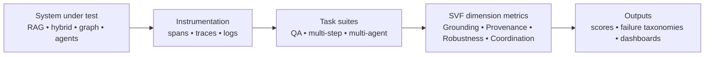

# SVF Deep Research for CFP Topic Selection and Positioning

## Executive summary

**Assumptions (explicit):** (i) You are submitting a **1‑page abstract (references excluded)** and may be invited to a **3–4 page proposal**; (ii) this report is **strictly for Abstract #3 (SVF: Structured Validation Framework)** and not for AKG‑E; any mention of simulation‑in‑the‑loop below is treated only as a *possible evaluation environment*, not an AKG‑E mapping; (iii) you want SVF positioned for the entity["company","Amazon","e-commerce and cloud"]–entity["organization","Virginia Tech","public university virginia"] CFP review process. fileciteturn1file12 fileciteturn2file0

**Workflow (including synthesis):** collect CFP subtopic lists → extract SVF claims/dimensions from your abstract and site write-up → survey 2023–2026 primary sources (papers + official docs/standards) → map advances and “known baselines” to SVF’s four dimensions → compare six CFP topics for SVF reviewer-fit → **synthesize**: (a) best primary/secondary topics, (b) specific strengthening edits, (c) lean citation set + BibTeX, (d) website-update prompt. fileciteturn2file0 fileciteturn2file1

**SVF in one line (from your material):** SVF evaluates knowledge-grounded and multi-agent systems along **grounding integrity**, **provenance traceability**, **reasoning robustness**, and **coordination reliability**, producing structured signals aligned with GenAI observability conventions. fileciteturn2file0

**Recommended CFP categories for SVF (top two):**
- **Primary: Agentic Evaluation** — SVF is an evaluation toolkit/benchmarking contribution and directly matches the abstract’s framing and the CFP’s evaluation bullet (“robust evaluation … including agents”). fileciteturn2file0 fileciteturn1file12  
- **Secondary: Responsible AI** — you explicitly evaluate robustness under adversarial inputs, cascading failures, and auditability; SVF’s provenance/governance focus supports “responsible deployment of compound systems.” fileciteturn2file0 fileciteturn1file12  

**Key “keep it straight” correction (important):** treat simulation‑in‑the‑loop as an *optional evaluation workload* (a kind of tool-using agent environment), not as an SVF core dependency. SVF’s novelty should remain “system-level measurement + validation loops + observability-aligned signals,” independent of any one domain. fileciteturn2file0



## Topic selection matrices for SVF

### Comparison matrix for the six CFP topics

| Topic | SVF reviewer fit | Novelty leverage for SVF | Feasibility (1 year) | Amazon relevance |
|---|---|---|---|---|
| Agentic Evaluation | **High** | **High** | Med–High | **High** |
| Responsible AI | High | Med | Medium | **High** |
| Retrieval‑Augmented Inference / Hybrid Retrieval | Med | Med | High | High |
| Knowledge Grounding | Med | Med | High | High |
| Agentic AI | Med | Low–Med | Med | High |
| AI for Science & Engineering | Low–Med | Low | Medium | Medium |

This aligns with your own “SVF is evaluation-first; better fit venues” note, but reframes it as “best-fit CFP category” rather than “don’t submit.” fileciteturn2file1

### Cross-reference matrix (how each topic supports SVF’s four dimensions)

Score: 0 weak signal for SVF, 1 partial, 2 strong, 3 best.

| CFP topic → / SVF dimension ↓ | Grounding integrity | Provenance traceability | Reasoning robustness | Coordination reliability |
|---|---:|---:|---:|---:|
| Agentic Evaluation | 3 | 3 | 3 | 3 |
| Responsible AI | 2 | 3 | 3 | 2 |
| Hybrid Retrieval | 3 | 1 | 2 | 1 |
| Knowledge Grounding | 3 | 2 | 2 | 1 |
| Agentic AI | 1 | 1 | 2 | 3 |
| AI for Science & Engineering | 1 | 1 | 2 | 1 |

## SVF state of the art and how to sharpen novelty

SVF’s strongest “research-shaped” claim is **integration**: most existing eval work focuses on *one slice* (RAG component metrics, citation/faithfulness, or agent benchmarks). Your differentiator should be “evaluate and debug compound systems end-to-end” through (i) unified metrics, (ii) **fault injection / cascade analysis**, and (iii) observability-aligned outputs suitable for production reliability engineering. fileciteturn2file0

To ground that claim, it helps to explicitly name and position against three widely cited baselines that your own website notes a reviewer may bring up:
- **RAGAS**: reference-free component metrics for RAG pipelines (retrieval + generation). ([arxiv.org](https://arxiv.org/abs/2309.15217))  
- **ARES**: trains lightweight judges on synthetic data to evaluate RAG components (context relevance, faithfulness, answer relevance). ([arxiv.org](https://arxiv.org/abs/2311.09476))  
- **TruLens**: tracing + evaluation of app execution flows (retrieval, tool calls, plans), emphasizing instrumentation. ([github.com](https://github.com/truera/trulens))  

Your “devil’s advocate” page is right: claiming “first evaluation framework” is brittle. A safer, stronger novelty statement is: **SVF unifies grounding + provenance + robustness + multi-agent fault injection into a single reproducible harness**, and it outputs **standard-structured telemetry** so evaluation is operationalizable, not just a benchmark score. fileciteturn2file1 ([opentelemetry.io](https://opentelemetry.io/docs/specs/semconv/gen-ai/))

## SVF by topic

### Agentic Evaluation

**Executive summary:** This is SVF’s home category. Anchor SVF as “benchmarking + methodology + tooling” for compound agentic systems, not as a generic evaluation wish list. fileciteturn2file0

**Key subtopics (6–10):** component-level RAG eval; end-to-end task suites; judge models and judge robustness; interactive environment eval; fault injection; reproducibility harnesses; cost/latency-aware eval; trace-based debugging; multi-agent coordination metrics.

**Recent advances (2023–2026):** RAGAS and ARES formalize RAG component metrics and automated judging; AgentBench and GAIA (below) show interactive agent evaluation patterns; observability standards are emerging for GenAI spans/traces. ([arxiv.org](https://arxiv.org/abs/2309.15217)) ([arxiv.org](https://arxiv.org/abs/2311.09476)) ([opentelemetry.io](https://opentelemetry.io/docs/specs/semconv/gen-ai/))

**Representative systems / provider features:** instrumentation-first evaluation (TruLens); standards-based tracing (OpenTelemetry GenAI spans). ([github.com](https://github.com/truera/trulens)) ([opentelemetry.io](https://opentelemetry.io/docs/specs/semconv/gen-ai/gen-ai-spans/))

**Open gaps/risks:** judge hacking/bias; weak grounding metrics for contradictory corpora; sparse evaluation of cascade failures; lack of shared “fault models” for multi-agent workflows. ([arxiv.org](https://arxiv.org/abs/2309.15217))

**Fundable SVF directions (3–5):**
- A **fault-injection benchmark** for multi-agent systems (drop tool, corrupt retrieval, delay responses) + cascade metrics.
- **Statement-level grounding tests**: relevance/sufficiency/attribution per claim, not only per answer.
- **Eval-to-telemetry pipeline**: emit OpenTelemetry-conformant spans + metrics so evaluation plugs into dashboards.
- **Judge robustness suite**: measure and mitigate judge sensitivity to ordering/prompting.

**Likely reviewer questions + pre-answers:**
- *What’s the hypothesis?* → compound failures are predictable and measurable; integrated metrics + fault models reduce incidents.
- *How is this different from RAGAS/ARES/TruLens?* → SVF adds multi-agent cascade analysis + observability-aligned outputs.
- *What do you ship in 12 months?* → toolkit + benchmark tasks + reproducible metrics + baselines.

**Title variants:** “SVF: Fault-Injection and Observability-Aligned Evaluation for Grounded Agents”; “From Answers to Audit Trails: System-Level Evaluation of Multi-Agent AI”.

**Recommended citations (3–5):** RAGAS; ARES; TruLens; OpenTelemetry GenAI. ([arxiv.org](https://arxiv.org/abs/2309.15217))

---

### Responsible AI

**Executive summary:** SVF supports Responsible AI by measuring *whether* systems stay grounded, auditable, and robust under adversarial and failure conditions—turning “responsible” into measurable properties. fileciteturn2file0

**Key subtopics:** red teaming as evaluation; adversarial retrieval/prompt injection; auditability requirements; overrefusal vs safety; governance metrics; privacy leakage in traces; safe tool execution; policy compliance scoring.

**Recent advances / industry practice:** centralized policy controls for agent-tool interactions are becoming productized, suggesting governance is an evaluation surface, not just an app feature. ([aws.amazon.com](https://aws.amazon.com/about-aws/whats-new/2026/03/policy-amazon-bedrock-agentcore-generally-available/))  
Production-focused jailbreak defenses (e.g., Constitutional Classifiers) quantify robustness vs overrefusal tradeoffs, which can inspire SVF-style metrics. ([anthropic.com](https://www.anthropic.com/research/next-generation-constitutional-classifiers))

**Gaps/risks:** safety evaluations can be gamed; policy changes can silently shift behavior; traces can leak sensitive data if not designed carefully.

**Fundable SVF directions:**
- **Prompt-injection and retrieval-poisoning eval pack** tied to grounding/provenance metrics.
- **Policy-compliance evaluation**: score adherence of tool calls to declared policies and input-validation rules.
- **Privacy-aware tracing**: evaluate what must/need-not be logged to preserve auditability without leaking.

**Reviewer Qs:** *Is this a safety proposal or eval proposal?* → evaluation proposal that operationalizes safety; *How do you avoid “just policies”?* → measure compliance + failure modes.

**Recommended citations:** AgentCore Policy GA; next-gen Constitutional Classifiers; OpenTelemetry GenAI. ([aws.amazon.com](https://aws.amazon.com/about-aws/whats-new/2026/03/policy-amazon-bedrock-agentcore-generally-available/))

---

### Retrieval‑Augmented Inference / Hybrid Retrieval

**Executive summary:** Hybrid retrieval is a known driver of grounding quality variation; SVF should treat retrieval as a *factor* with explicit stress tests (noise, contradictions, query-type shifts). fileciteturn2file0

**Key subtopics:** sparse+dense hybrid; reranking; query decomposition; retrieval evaluation; corrective retrieval actions; evidence sufficiency scoring.

**Recent advances:** CRAG formalizes retrieval-quality evaluation and corrective actions when retrieval “goes wrong,” aligning directly with SVF’s robustness dimension. ([arxiv.org](https://arxiv.org/abs/2401.15884?utm_source=chatgpt.com))

**Gaps:** retrieval improvements often lack standardized evaluation across system dimensions (grounding, provenance, robustness).

**Fundable SVF directions:** retrieval stress harness; retrieval-quality classifiers; cross-retriever comparisons with cascade metrics.

**Recommended citations:** CRAG; ARES; RAGAS. ([arxiv.org](https://arxiv.org/abs/2401.15884?utm_source=chatgpt.com))

---

### Knowledge Grounding

**Executive summary:** Knowledge grounding overlaps with hybrid retrieval but adds multi-source fusion and attribution; SVF can provide “grounding integrity + provenance traceability” metrics that quantify grounding quality beyond answer accuracy. fileciteturn2file0

**Key subtopics:** evidence sufficiency; attribution accuracy; span-level citations; contradiction handling; graph-based grounding.

**Recent advances:** GraphRAG targets “global” questions and shows that plain RAG fails for whole-corpus sensemaking—useful as a system-under-test class in SVF. ([arxiv.org](https://arxiv.org/abs/2404.16130?utm_source=chatgpt.com))

**Gaps:** “valid-looking citations” that don’t fully support claims (your abstract cites this risk); SVF should operationalize that into measurable tests. fileciteturn2file0

**Fundable directions:** statement-level citation checks; contradiction tests; provenance depth scoring.

**Recommended citations:** GraphRAG; RAGAS; TruLens. ([arxiv.org](https://arxiv.org/abs/2404.16130?utm_source=chatgpt.com))

---

### Agentic AI

**Executive summary:** SVF depends on agentic execution traces: plans, tool calls, retries, and failure recovery. SVF can position “coordination reliability” as missing from most RAG-only eval suites.

**Key subtopics:** multi-step tool orchestration; tool routing errors; parameter errors; recovery latency; multi-agent communication.

**Industry practice:** tool integration ecosystems are scaling, and standardized tool protocols like MCP are supported across platforms—this increases the importance of measuring tool selection/parameterization errors and recovery. ([docs.aws.amazon.com](https://docs.aws.amazon.com/bedrock-agentcore/latest/devguide/gateway.html)) ([learn.microsoft.com](https://learn.microsoft.com/en-us/agent-framework/agents/tools/local-mcp-tools))

**Fundable directions:** tool-call fault injection; coordination metrics; run replayability via trace logs.

**Recommended citations:** OpenAI function calling; AgentCore Gateway; Microsoft MCP tools guide. ([developers.openai.com](https://developers.openai.com/api/docs/guides/function-calling/))

---

### AI for Science & Engineering

**Executive summary:** This is the weakest “home” for SVF, but science/engineering can serve as a demanding *evaluation workload class* (tool-using systems, simulation tools, interpretability constraints). Keep it as an example, not the primary topic.

**Key subtopics:** tool-based simulation tasks; correctness under physical constraints; interpretability checks; uncertainty reporting.

**Recent advances:** MCP-SIM-style work indicates a trend toward language-driven simulation with multi-agent correction; SVF can borrow the idea of convergence criteria and interpretability checks as robustness tests for tool workflows. ([nature.com](https://www.nature.com/articles/s44387-025-00057-z))

**Recommended citations:** MCP-SIM; OpenTelemetry GenAI; TruLens tracing. ([nature.com](https://www.nature.com/articles/s44387-025-00057-z))

## Practical edits to strengthen SVF (based on your own critique page)

Your site notes four weaknesses: “meta problem,” “dimensions feel obvious,” “novelty overclaim,” and “coordination reliability underdeveloped.” Convert these into fixes:

- Add **one crisp hypothesis** per dimension and connect to measurable metrics (e.g., “fault injection predicts cascade risk”). fileciteturn2file1  
- Narrow novelty claim: “SVF **integrates** grounding+provenance+robustness+coordination and outputs observability-aligned signals,” rather than “first framework.” fileciteturn2file1  
- Strengthen coordination: specify concrete benchmarks (tool-selection confusion, parameter error rates, recovery latency) and fault models. fileciteturn2file0  

## Image/diagram suggestions

- A single “SVF dashboard” figure: four dimension scores + trace snippet linking claim→evidence span. fileciteturn2file0  
- A “fault injection” figure: break retriever / corrupt evidence / drop agent → measure cascade + recovery latency. fileciteturn2file0  
- An “observability mapping” figure: SVF metrics → OpenTelemetry spans/attributes. ([opentelemetry.io](https://opentelemetry.io/docs/specs/semconv/gen-ai/))

## Claude prompt to update the website from this MD file

```markdown
You are editing our static website repo (multiple HTML pages with a shared nav bar).
Goal: publish the attached Markdown report as a new page and link it in navigation.

Constraints:
- Keep the report text unchanged (only minimal formatting for HTML rendering).
- Preserve styling conventions (dark theme, orange accents).
- Add a nav item “SVF Deep Research (MD)” pointing to the new page.

Tasks:
1) Create a new file: svf-deep-research.md (or docs/svf-deep-research.md).
2) Create a corresponding HTML page svf-deep-research.html that:
   - embeds the Markdown-rendered content
   - uses the same header/nav CSS as proposal-svf.html
3) Update the nav bar across pages (index.html, proposal-svf.html, etc.) to include the link.
4) Ensure Mermaid diagrams render:
   - If we have no Mermaid pipeline, add a lightweight client-side Mermaid renderer
     and wrap mermaid blocks appropriately.
5) Output a list of all modified files and a short rationale.

Here is the Markdown content to publish:
[PASTE REPORT MD HERE]
```

## Ready-to-paste BibTeX for recommended SVF citations

```bibtex
@article{Es2023RAGAS,
  author  = {Es, Shahul and James, Jithin and Espinosa-Anke, Luis and Schockaert, Steven},
  title   = {RAGAS: Automated Evaluation of Retrieval Augmented Generation},
  year    = {2023},
  journal = {arXiv},
  url     = {https://arxiv.org/abs/2309.15217},
  note    = {Accessed 2026-03-15}
}

@article{SaadFalcon2024ARES,
  author  = {Saad-Falcon, Jonah and others},
  title   = {ARES: An Automated Evaluation Framework for Retrieval-Augmented Generation Systems},
  year    = {2024},
  journal = {NAACL},
  url     = {https://arxiv.org/abs/2311.09476},
  note    = {Accessed 2026-03-15}
}

@misc{TruLensGitHub,
  author       = {{Truera}},
  title        = {TruLens: Evaluation and tracking for LLM experiments (open source)},
  year         = {2024},
  howpublished = {GitHub repository},
  url          = {https://github.com/truera/trulens},
  note         = {Accessed 2026-03-15}
}

@misc{OpenTelemetryGenAI2024,
  author       = {{OpenTelemetry}},
  title        = {Semantic conventions for generative AI systems},
  year         = {2024},
  howpublished = {OpenTelemetry Specification},
  url          = {https://opentelemetry.io/docs/specs/semconv/gen-ai/},
  note         = {Accessed 2026-03-15}
}

@article{Yan2024CRAG,
  author  = {Yan, Shi-Qi and Gu, Jia-Chen and Zhu, Yun and Ling, Zhen-Hua},
  title   = {Corrective Retrieval Augmented Generation},
  year    = {2024},
  journal = {arXiv},
  url     = {https://arxiv.org/abs/2401.15884},
  note    = {Accessed 2026-03-15}
}

@article{Edge2024GraphRAG,
  author  = {Edge, Darren and others},
  title   = {From Local to Global: A Graph RAG Approach to Query-Focused Summarization},
  year    = {2024},
  journal = {arXiv},
  url     = {https://arxiv.org/abs/2404.16130},
  note    = {Accessed 2026-03-15}
}

@misc{OpenAIFunctionCalling2025,
  author       = {{OpenAI}},
  title        = {Function calling (tool calling flow)},
  year         = {2025},
  month        = aug,
  howpublished = {OpenAI Developer Documentation},
  url          = {https://developers.openai.com/api/docs/guides/function-calling/},
  note         = {Accessed 2026-03-15}
}

@misc{AWSAgentCoreGatewayMCP,
  author       = {{Amazon Web Services}},
  title        = {Amazon Bedrock AgentCore Gateway (convert APIs to MCP-compatible tools)},
  year         = {2025},
  howpublished = {AWS Documentation},
  url          = {https://docs.aws.amazon.com/bedrock-agentcore/latest/devguide/gateway.html},
  note         = {Accessed 2026-03-15}
}

@misc{MicrosoftAgentFrameworkMCP2026,
  author       = {{Microsoft}},
  title        = {Agent Framework: Using MCP tools with Agents},
  year         = {2026},
  month        = feb,
  howpublished = {Microsoft Learn},
  url          = {https://learn.microsoft.com/en-us/agent-framework/agents/tools/local-mcp-tools},
  note         = {Accessed 2026-03-15}
}

@article{Park2026MCPSIM,
  author  = {Park, D. and others},
  title   = {A self-correcting multi-agent LLM framework for language-based physics simulation and explanation},
  year    = {2026},
  journal = {npj Artificial Intelligence},
  url     = {https://www.nature.com/articles/s44387-025-00057-z},
  note    = {Accessed 2026-03-15}
}

@misc{AWSAgentCorePolicyGA2026,
  author       = {{Amazon Web Services}},
  title        = {Policy in Amazon Bedrock AgentCore is now generally available},
  year         = {2026},
  month        = mar,
  howpublished = {AWS What's New},
  url          = {https://aws.amazon.com/about-aws/whats-new/2026/03/policy-amazon-bedrock-agentcore-generally-available/},
  note         = {Accessed 2026-03-15}
}

@misc{AnthropicNextGenCC2026,
  author       = {{Anthropic}},
  title        = {Next-generation Constitutional Classifiers: More efficient protection against universal jailbreaks},
  year         = {2026},
  month        = jan,
  howpublished = {Anthropic Research},
  url          = {https://www.anthropic.com/research/next-generation-constitutional-classifiers},
  note         = {Accessed 2026-03-15}
}

@misc{AWSBedrockGuardrailsDocs2025,
  author       = {{Amazon Web Services}},
  title        = {Amazon Bedrock Guardrails documentation},
  year         = {2025},
  howpublished = {AWS Documentation},
  url          = {https://docs.aws.amazon.com/bedrock/latest/userguide/guardrails.html},
  note         = {Accessed 2026-03-15}
}
```