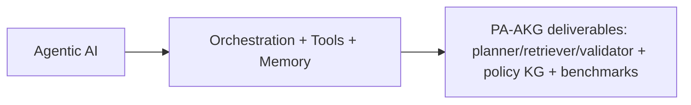
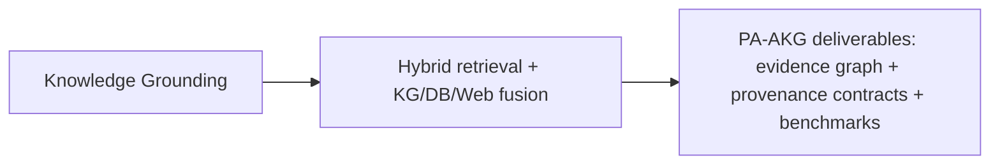
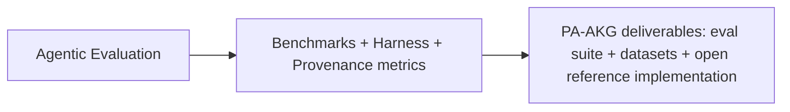
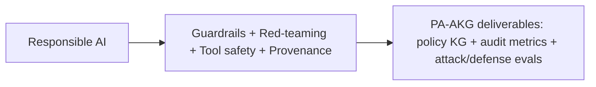
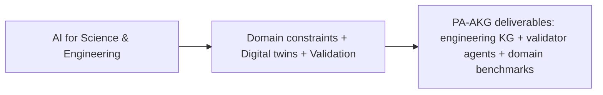

# CFP Topic Due Diligence for PA‑AKG Submission

## Executive summary

**Assumptions (unstated details I’m inferring):** (i) you will submit a **1‑page abstract** (references excluded) by the CFP deadline and, if invited, a **3–4 page full proposal**; (ii) your current research thrusts include **agentic knowledge graphs**, **KG‑RAG / hybrid retrieval**, **provenance & evidence tracing**, **systems/serving efficiency (e.g., memory disaggregation / KV‑cache efficiency)**, and **construction‑AI / digital‑twin engineering use cases**; (iii) you can select **primary + secondary** CFP categories. fileciteturn0file0

**Workflow used (including synthesis):** collect CFP subtopic lists → survey 2023–2026 papers + primary/official docs → extract advances/systems/gaps per subtopic → compare topics on reviewer alignment/novelty/feasibility/Amazon relevance → **synthesize** a ranked recommendation + PA‑AKG cross‑reference matrix + proposal-ready citation set. fileciteturn0file0

**Bottom line:** the strongest two categories for a PA‑AKG proposal are:

- **Primary: Knowledge Grounding** (direct CFP match; strongest reviewer alignment to hybrid retrieval + heterogeneous sources + memory-augmented systems). fileciteturn0file0turn7search2turn7search0  
- **Secondary: Agentic AI** (direct CFP match; aligns with orchestration, multi-agent systems, autonomy, tooling standards, and Amazon’s agent platform direction). fileciteturn0file0turn7search1turn6view0turn6view2  

### Cross-topic comparison table

Scores are qualitative (High/Med/Low) and reflect CFP fit + 2023–2026 ecosystem maturity.

| CFP topic | Reviewer alignment to PA‑AKG | Novelty headroom | Feasibility (1 year) | Amazon relevance |
|---|---|---|---|---|
| Knowledge Grounding | **High** | High | **High** | **High** |
| Agentic AI | **High** | Med–High | **High** | **High** |
| Agentic Evaluation | Med–High | High | Med | High |
| Responsible AI | Medium | Med–High | Med | High |
| AI for Science & Engineering | Medium | High | Med | Med–High |

**Overall ranking for submission (primary + secondary):**  
1) Knowledge Grounding  
2) Agentic AI  
3) Agentic Evaluation  
4) Responsible AI  
5) AI for Science & Engineering  

(Primary/secondary should optimize *reviewer matching*: choose the bucket where your core contributions are unmistakable, then use the secondary to widen reviewer pool without diluting focus.) fileciteturn0file0

### PA‑AKG fit matrix vs your work to date

Score: 0 = weak, 1 = partial, 2 = strong, 3 = best-in-class fit.

| Topic → / Your work ↓ | Agentic KGs | KG‑RAG / hybrid retrieval | Provenance & evidence | Systems efficiency (memory/serving) | Construction‑AI / digital twins |
|---|---:|---:|---:|---:|---:|
| Agentic AI | 3 | 2 | 2 | 3 | 2 |
| Knowledge Grounding | 3 | 3 | 2 | 2 | 1 |
| Agentic Evaluation | 2 | 2 | 3 | 2 | 1 |
| Responsible AI | 1 | 1 | 3 | 2 | 1 |
| AI for Science & Engineering | 2 | 1 | 1 | 2 | 3 |

Interpretation: **Knowledge Grounding** is the cleanest “home” for PA‑AKG (hybrid retrieval + heterogeneous sources + memory augmentation), while **Agentic AI** is the cleanest “home” for orchestration, autonomy, and multi-agent workflows. fileciteturn0file0

## Agentic AI

**Topic executive summary:** The CFP’s Agentic AI subtopics map directly onto PA‑AKG’s “agent + knowledge substrate” framing. The strongest contemporary angle is that agents are now *platformized*: tool standards (MCP), tool-calling APIs, and production agent runtimes make agent orchestration a first-class systems problem, not just prompting. fileciteturn0file0turn6view0turn6view2turn7search1

**CFP subtopics (anchor list):** autonomous tasking; informal reasoning; low/no-code business agents; multi-agent systems/orchestration; continual post-deploy improvement; agent-environment simulation/world models; internationalization; applications incl. agentic coding, deep research, cybersecurity. fileciteturn0file0

**Key subtopics to emphasize (6–10, CFP-aligned):** orchestration architectures; tool discovery/routing; memory & state; multi-agent comms protocols; validation/oversight agents; safe tool execution; agentic coding workflows; simulation/world-model loops; personalization/internationalization.

**Recent advances (2023–2026):**  
- Tool-use learning and “LLM-as-controller” patterns matured (e.g., Toolformer shows self-supervised learning of when/how to call tools). citeturn7search2  
- Agent platforms emphasize secure deployment + monitoring at scale (e.g., Bedrock AgentCore positioning: build/deploy/operate agents securely at scale, with monitoring). citeturn6view0  
- Tool connectivity is standardizing: Anthropic’s **Model Context Protocol** defines an open standard for secure, two-way connections between tools/data and AI applications. citeturn6view2  
- Tool calling is now explicitly modeled as a multi-step orchestration loop in API docs (request → tool call → execute → return → iterate). citeturn7search1  
- “Agent-computer interfaces” are a major performance lever (SWE-agent shows interface design materially improves autonomous coding agents). citeturn6view9  

**Representative systems / provider features (authoritative links):** Bedrock AgentCore (agent runtime + multi-agent building blocks); MCP standard; OpenAI tool calling. citeturn6view0turn6view1turn6view2turn7search1

**Open gaps & risks (PA‑AKG-relevant):** tool injection + least-privilege; brittleness in tool selection/parameterization; provenance gaps across long multi-step plans; evaluation drift after post-deploy updates; multi-agent emergent failure modes. citeturn6view1turn7search1turn6view2

**Fundable PA‑AKG directions (3–5):**
- **PA‑AKG Orchestrator**: planner→retriever→validator agents operating over a KG + hybrid retrieval layer, with explicit provenance contracts.
- **Tool governance via KG policies**: represent tool permissions, data lineage, and allowed action graphs in a KG; enforce at runtime.
- **Agent memory disaggregation**: tiered memory for agent state (short-term context, episodic logs, KG memory) with measurable latency/cost tradeoffs.
- **Construction‑AI agents**: schedule/BOM/constraint agents grounded by a construction KG; validated by simulation/constraints.

**Likely reviewer questions + pre-answers:**
- *Why is this not “just another agent framework”?* → novelty is provenance-aware KG substrate + measurable reliability gains (auditable chains, failure recovery).
- *How will you keep tools safe?* → least-privilege + policy graph + sandboxed execution; log every action with provenance.
- *What will you deliver in 1 year?* → reference implementation + benchmark tasks + ablations across (vector RAG vs hybrid vs KG).

**One-line title variants:**
- “Provenance-Aware Agentic Knowledge Graphs for Reliable Tool-Using AI”
- “Policy-Grounded Multi-Agent Systems with Auditable Knowledge Graph Memory”
- “Agentic KG Substrates for Verified Planning, Retrieval, and Action”

**Recommended citations (3–5) for proposal/abstract:** `Toolformer2023`; `OpenAIFunctionCalling2025`; `AnthropicMCP2024`; `AWSAgentCoreGA2025`; `SWEAgent2024`. citeturn7search2turn7search1turn6view2turn6view0turn6view9



## Knowledge Grounding

**Topic executive summary:** This is the most direct “bucket” for PA‑AKG. The CFP explicitly calls out **memory-augmented generative AI**, **heterogeneous retrieval across KGs/DBs/web/local**, and **fusion of multiple knowledge sources**—which is exactly where a provenance-aware agentic KG system differentiates from baseline RAG. fileciteturn0file0turn7search2turn7search0

**CFP subtopics (anchor list):** grounding on world/domain/enterprise/personal knowledge; memory-augmented systems; multimodal retrieval across heterogeneous sources (KGs/People Graphs/DBs/Web/Local); fusion; improved LLM↔external knowledge interaction. fileciteturn0file0

**Key subtopics to emphasize (6–10, CFP-aligned):** sparse+dense hybrid retrieval; retrieval routing; reranking; structured query grounding (SQL/SPARQL); graph-based retrieval; multimodal grounding; freshness + update pipelines; attribution/citations; conflict detection across sources.

**Recent advances (2023–2026):**  
- **Hybrid retrieval as a product primitive**: Bedrock Knowledge Bases added hybrid search as a selectable mode combining keyword + semantic search. citeturn8view0  
- Official docs increasingly describe retrieval systems that include **citations**, reranking, and structured-query conversion. citeturn7search2turn7search6  
- **Tool-based hybrid retrieval**: OpenAI file search explicitly supports semantic + keyword search over uploaded corpora. citeturn7search0  
- **Graph-structured grounding**: GraphRAG formalizes graph-based approaches for global reasoning across private corpora beyond “top‑k chunks.” citeturn8view8turn11view1  
- **Robustness to bad retrieval**: CRAG adds a retrieval evaluator that triggers different retrieval actions when context is low quality. citeturn8view10  

**Representative systems / provider features (authoritative links):** Bedrock Knowledge Bases (citations, reranking, structured queries); Bedrock hybrid search; OpenAI file search; GraphRAG. citeturn7search2turn8view0turn7search0turn8view8

**Open gaps & risks:** measurable “citation faithfulness” (citations that don’t fully support claims); schema drift and KG staleness; fusion under contradictions; retrieval poisoning; prompt injection via tool-connected data. citeturn12view0turn7search2turn8view10

**Fundable PA‑AKG directions (3–5):**
- **Hybrid KG‑RAG router** that chooses among sparse/dense/graph/structured retrieval per query, with provenance-aware policies.
- **Evidence-first generation** (quote/span selection → constrained synthesis), targeting verifiable outputs.
- **Heterogeneous fusion engine** that reconciles conflicting sources using KG constraints + validator agents.
- **Streaming KG updates** for enterprise knowledge with drift detection and provenance persistence.

**Likely reviewer questions + pre-answers:**
- *How is this beyond existing RAG products?* → emphasize cross-source fusion + auditability + KG reasoning, not just retrieval.
- *What metrics prove improvement?* → citation faithfulness, contradiction handling, multi-hop accuracy, latency/cost.
- *How will you handle structured + unstructured together?* → unified “evidence graph” linking docs, DB rows, and KG nodes.

**One-line title variants:**
- “Provenance-Aware Hybrid KG‑RAG for Verifiable Grounded AI”
- “Heterogeneous Grounding with Knowledge Graph Fusion and Evidence Chains”
- “Beyond Vector RAG: Auditable Multi-Source Grounding with Agentic KGs”

**Recommended citations (3–5):** `AWSBedrockHybridSearch2024`; `OpenAIFileSearchTool2025`; `Edge2024GraphRAG`; `Yan2024CRAG`; `AWSBedrockKnowledgeBasesDocs2025`. citeturn8view0turn7search0turn8view8turn8view10turn7search2



## Agentic Evaluation

**Topic executive summary:** The CFP’s evaluation category is small in bullets but strategically valuable: evaluation is a bottleneck for deploying agents and grounded systems. PA‑AKG can win here by proposing **evaluation infrastructure for provenance, retrieval robustness, and agent reliability**, not just new benchmarks. fileciteturn0file0turn6view7turn6view8

**CFP subtopics (anchor list):** new benchmarks for foundation model capabilities; robust evaluation methodologies for generative AI systems (including agents). fileciteturn0file0

**Key subtopics to emphasize (6–10):** benchmark design for tool use; provenance/citation scoring; interactive environment evals; failure-mode taxonomies; multi-agent coordination metrics; robustness under retrieval noise; cost/latency-aware evaluation; “eval harness” reproducibility.

**Recent advances (2023–2026):**  
- AgentBench provides multi-environment evaluation for “LLM-as-agent” reasoning/decision-making. citeturn6view7  
- GAIA benchmarks general AI assistants on real-world questions requiring reasoning, tool use, and web browsing skills. citeturn6view8  
- OpenAI’s open-source **evals** framework provides a registry and harness for evaluating LLMs/systems and writing custom evals. citeturn3search2  

**Representative systems / provider features:** AgentBench/GAIA benchmarks; `openai/evals` harness; vendors increasingly expose evaluation tooling via docs/guides. citeturn6view7turn6view8turn3search2

**Open gaps & risks:** overfitting to benchmark scaffolds; hidden prompt leakage; mismatch between offline evals and production; lack of standardized provenance metrics; expensive human validation loops. citeturn6view7turn3search2turn12view0

**Fundable PA‑AKG directions (3–5):**
- **ProvenanceScore**: statement-level citation faithfulness + evidence coverage metrics (for RAG + KG).
- **Retrieval Robustness Suite**: adversarial retrieval contamination + contradiction tests (CRAG-like conditions).
- **Agent Trace Bench**: evaluate agent plans as graphs (steps, tools, evidence) for correctness + auditability.
- **Construction-AI eval tasks**: constraint satisfaction + schedule plausibility with verifiable evidence.

**Likely reviewer questions + pre-answers:**
- *Why is this not “just another benchmark”?* → deliver a reusable harness + metrics + datasets tied to real failure modes (provenance, contradictions, tool safety).
- *How will you validate without huge human effort?* → combine automated judges with targeted expert spot-checks.
- *How does this help Amazon?* → evaluation reduces deployment risk; improves reliability/cost predictability.

**One-line title variants:**
- “Evaluating Provenance and Robustness in Knowledge-Grounded AI Agents”
- “A Benchmark and Harness for Auditable Multi-Step Agentic Reasoning”
- “From Answers to Audit Trails: Metrics for Reliable Grounded Agents”

**Recommended citations (3–5):** `Liu2023AgentBench`; `Mialon2023GAIA`; `OpenAIEvalsRepo`; (optional) `Wu2025SourceCheckup` for citation auditing. citeturn6view7turn6view8turn3search2turn12view0



## Responsible AI

**Topic executive summary:** Responsible AI is high-value for Amazon relevance but easiest to “lose focus” unless tightly scoped. PA‑AKG fits best by treating provenance + tool governance as safety primitives: guardrails + red-teaming + prompt-injection defenses + auditable traces of agent actions. fileciteturn0file0turn6view3turn6view4turn6view5

**CFP subtopics (anchor list):** red teaming; robustness to jailbreaking/membership inference/watermarking/deepfake detection; responsible agentic AI (multi-agent robustness, guardrails); frontier risk measurement/alignment; international/cultural alignment. fileciteturn0file0

**Key subtopics to emphasize (6–10):** prompt injection defenses; tool safety + least privilege; guardrails policy design; red-teaming automation; provenance as accountability; overrefusal tradeoffs; multilingual/cultural policy tuning; attack surface in agent tool protocols; secure logging/observability.

**Recent advances (2023–2026):**  
- Amazon Bedrock Guardrails provides configurable safeguards to filter harmful content and protect sensitive info. citeturn6view3  
- Anthropic’s Constitutional Classifiers line targets universal jailbreak robustness with quantified overrefusal/cost tradeoffs. citeturn6view4  
- OpenAI publishes a Model Spec describing safety goals and a “chain of command” framing for instruction-following tradeoffs. citeturn6view5turn1search16  
- Meta’s Prompt Guard model card positions a classifier for malicious prompts/prompt injection and explicitly recommends layered defenses. citeturn6view6  

**Representative systems / provider features:** Bedrock Guardrails; Constitutional Classifiers; Model Spec; Prompt Guard. citeturn6view3turn6view4turn6view5turn6view6

**Open gaps & risks:** safety mechanisms can increase cost/latency and trigger overrefusal; tool protocols expand attack surface; provenance can be gamed (selective citation); multi-agent interactions create new failure modes; policy generalization across cultures remains hard. citeturn6view4turn6view6turn6view1

**Fundable PA‑AKG directions (3–5):**
- **Provenance-as-guardrail**: reject or down-rank generations without evidence coverage; enforce minimal citation granularity.
- **Tool-policy KG**: represent allowed action graphs and data-flow constraints; runtime enforcement for agents.
- **Prompt-injection testbed** for hybrid retrieval + tool-connected corpora (attack + defense evaluation).
- **Cultural alignment layer**: encode policy variants and provenance expectations per locale/domain.

**Likely reviewer questions + pre-answers:**
- *Is this a safety project or a knowledge project?* → it’s both: safety through accountable grounding + controlled tool use.
- *How will you quantify safety?* → jailbreak/prompt-injection success rates; PII leakage; policy compliance; audit completeness.
- *How will you avoid “just integrating third-party guardrails”?* → research contribution is provenance contracts + KG policy substrate + measurable enforcement.

**One-line title variants:**
- “Responsible Agentic Systems via Provenance Contracts and Tool-Policy Knowledge Graphs”
- “Guardrailed Grounded AI: Evidence-First Generation with Auditable Tool Use”
- “Safety Through Structure: Policy-Grounded Agents with Verifiable Evidence Chains”

**Recommended citations (3–5):** `AWSBedrockGuardrailsDocs2025`; `AnthropicConstitutionalClassifiers2025`; `OpenAIModelSpec2025`; `MetaPromptGuard2024`. citeturn6view3turn6view4turn6view5turn6view6



## AI for Science and Engineering

**Topic executive summary:** This category can be compelling if you lead with a concrete engineering domain (e.g., construction digital twins, PDE-constrained optimization, design automation). Its risk is reviewer mismatch if the proposal reads as “general agent/KG” without a crisp scientific objective and evaluation in a domain benchmark. fileciteturn0file0turn6view10turn6view13turn6view12

**CFP subtopic (anchor list):** systems leveraging generative AI to advance science/technology in physics, math, chemistry, biology, hardware design, materials science, engineering, economics, healthcare, climate. fileciteturn0file0

**Key subtopics to emphasize (6–10):** scientific foundation models; simulation + generative modeling; scientific knowledge grounding; experiment planning agents; digital twins; uncertainty quantification & validation; data flywheels; domain constraints; reproducibility; safety in engineering decision support.

**Recent advances (2023–2026):**  
- AlphaFold 3 extends diffusion-based biomolecular structure prediction to complexes (proteins, nucleic acids, small molecules, ions). citeturn6view10  
- GNoME scaled active learning + GNN modeling to accelerate materials discovery and stability prediction (published in Nature; promoted via DeepMind blog). citeturn6view13turn6view11  
- Emerging “physics foundation models” (e.g., PhysiX) explicitly target generalizable physics simulation. citeturn6view12turn6view14  

**Representative systems / provider features:** scientific foundation models (AlphaFold/GNoME/PhysiX) illustrate where domain breakthroughs come from; for PA‑AKG, the “provider feature” analog is strong grounding + evaluation + reproducible pipelines (often via enterprise platforms), but you should anchor on the *domain system* you’ll build and validate. citeturn6view10turn6view13turn6view12

**Open gaps & risks:** heavy data/compute; evaluation complexity (sim+real-world validation); domain-specific IP/availability; risk of being seen as “application” rather than core AI unless you extract generalizable methods (e.g., provenance-aware constraint reasoning). citeturn6view12turn6view13

**Fundable PA‑AKG directions (3–5):**
- **Construction digital-twin KG agents**: plan/monitor/diagnose with evidence from sensor logs + BIM + schedules.
- **Constraint-grounded engineering reasoning**: agents that propose actions but must pass constraint checks (codes/physics/schedules).
- **Simulation-in-the-loop validation**: validator agents run lightweight simulations to verify candidate plans.
- **Data flywheel for engineering KGs**: ingest new project artifacts to update KG with provenance tracking.

**Likely reviewer questions + pre-answers:**
- *What science/engineering breakthrough will you show?* → pick one measurable domain target (e.g., schedule risk prediction accuracy; constraint violation reduction).
- *How will you validate?* → domain benchmarks + ablations (prompt-only vs RAG vs KG+validators).
- *Why is this Amazon-relevant?* → scalable decision-support + digital-twin ops needs; aligns with practical AI deployment constraints.

**One-line title variants:**
- “Agentic Knowledge Graph Digital Twins for Verified Engineering Decision Support”
- “Provenance-Aware AI for Engineering: Constraint-Grounded Retrieval and Planning”
- “Simulation-Validated Agents for Construction Operations and Safety”

**Recommended citations (3–5):** `Abramson2024AlphaFold3`; `Merchant2023GNoME`; `Nguyen2025PhysiX`. citeturn6view10turn6view13turn6view12



## Repo-ready assets

### Prompt for Claude to update your website from this Markdown report

Below is a **copy/paste prompt** you can feed to Claude in Cursor/VSCode. It assumes (a) your website repo supports Markdown pages (static site generator or docs site), (b) you want a new page added, and (c) you want nav updated. Adjust the paths to match your repo.

```markdown
You are working inside a Git repository for our website/docs.

Goal:
- Publish the attached report Markdown file as a new page on the website.
- Add it to site navigation.
- Ensure formatting is clean (tables and mermaid blocks render).
- Do NOT change the technical content except for small formatting fixes needed for the site generator.

Inputs:
- The report is in: docs/reports/cfp-topic-due-diligence.md  (content pasted below)
- The site uses Markdown pages with frontmatter.
- Mermaid blocks should render; if the site requires a plugin/config, implement it.

Tasks:
1) Create (or update) the file:
   docs/reports/cfp-topic-due-diligence.md

   Add frontmatter at top (adjust keys to our site conventions):
   ---
   title: "CFP Topic Due Diligence for PA-AKG"
   description: "Deep research comparison of five CFP topic areas and recommendation of primary/secondary categories."
   slug: /reports/cfp-topic-due-diligence
   ---

2) Confirm all markdown tables render and are readable on mobile:
   - If needed, wrap wide tables in a div or use site-supported table scroll wrappers (but keep content identical).

3) Add the page to navigation:
   - If Docusaurus: update sidebars.js to include "reports/cfp-topic-due-diligence"
   - If MkDocs: update mkdocs.yml nav
   - If Next.js contentlayer: add link entry to the docs index

4) Ensure mermaid renders:
   - If Docusaurus: ensure @docusaurus/theme-mermaid is enabled and markdown supports mermaid.
   - If MkDocs: enable pymdownx.superfences + mermaid fenced blocks.
   - If Next.js: add mermaid support consistent with current stack.

5) Provide a concise summary of all file changes (paths + what changed), suitable for a PR description.

Here is the Markdown report content to publish:
[PASTE THE ENTIRE REPORT MARKDOWN HERE]
```

### Combined BibTeX block for recommended citations

```bibtex
@misc{AWSAgentCoreGA2025,
  author       = {{Amazon Web Services}},
  title        = {Amazon Bedrock AgentCore is now generally available},
  year         = {2025},
  month        = oct,
  howpublished = {AWS What's New},
  url          = {https://aws.amazon.com/about-aws/whats-new/2025/10/amazon-bedrock-agentcore-available/},
  note         = {Accessed 2026-03-11}
}

@misc{AnthropicMCP2024,
  author       = {{Anthropic}},
  title        = {Introducing the Model Context Protocol},
  year         = {2024},
  month        = nov,
  howpublished = {Anthropic News},
  url          = {https://www.anthropic.com/news/model-context-protocol},
  note         = {Accessed 2026-03-11}
}

@misc{OpenAIFunctionCalling2025,
  author       = {{OpenAI}},
  title        = {Function calling guide (tool calling flow)},
  year         = {2025},
  month        = aug,
  howpublished = {OpenAI Developer Documentation},
  url          = {https://developers.openai.com/api/docs/guides/function-calling/},
  note         = {Accessed 2026-03-11}
}

@article{Schick2023Toolformer,
  author  = {Schick, Timo and Dwivedi-Yu, Jane and Dess{\`\i}, Roberto and Raileanu, Roberta and Lomeli, Maria and Zettlemoyer, Luke and Cancedda, Nicola and Scialom, Thomas},
  title   = {Toolformer: Language Models Can Teach Themselves to Use Tools},
  year    = {2023},
  journal = {arXiv},
  url     = {https://arxiv.org/abs/2302.04761},
  note    = {Accessed 2026-03-11}
}

@article{Yang2024SWEAgent,
  author  = {Yang, John and others},
  title   = {SWE-agent: Agent-Computer Interfaces Enable Automated Software Engineering},
  year    = {2024},
  journal = {arXiv},
  url     = {https://arxiv.org/abs/2405.15793},
  note    = {Accessed 2026-03-11}
}

@misc{AWSBedrockHybridSearch2024,
  author       = {{Amazon Web Services}},
  title        = {Amazon Bedrock Knowledge Bases now supports hybrid search},
  year         = {2024},
  month        = mar,
  howpublished = {AWS Machine Learning Blog},
  url          = {https://aws.amazon.com/blogs/machine-learning/amazon-bedrock-knowledge-bases-now-supports-hybrid-search/},
  note         = {Accessed 2026-03-11}
}

@misc{AWSBedrockKnowledgeBasesDocs2025,
  author       = {{Amazon Web Services}},
  title        = {Retrieve data and generate AI responses with Amazon Bedrock Knowledge Bases},
  year         = {2025},
  howpublished = {AWS Documentation},
  url          = {https://docs.aws.amazon.com/bedrock/latest/userguide/knowledge-base.html},
  note         = {Accessed 2026-03-11}
}

@misc{OpenAIFileSearchTool2025,
  author       = {{OpenAI}},
  title        = {File search (Responses API tool): semantic + keyword retrieval over uploaded files},
  year         = {2025},
  howpublished = {OpenAI Developer Documentation},
  url          = {https://developers.openai.com/api/docs/guides/tools-file-search/},
  note         = {Accessed 2026-03-11}
}

@article{Edge2024GraphRAG,
  author  = {Edge, Darren and others},
  title   = {From Local to Global: A Graph RAG Approach to Query-Focused Summarization},
  year    = {2024},
  journal = {arXiv},
  url     = {https://arxiv.org/abs/2404.16130},
  note    = {Accessed 2026-03-11}
}

@article{Yan2024CRAG,
  author  = {Yan, Shiqi and others},
  title   = {Corrective Retrieval Augmented Generation},
  year    = {2024},
  journal = {arXiv},
  url     = {https://arxiv.org/abs/2401.15884},
  note    = {Accessed 2026-03-11}
}

@article{Liu2023AgentBench,
  author  = {Liu, Xueqing and others},
  title   = {AgentBench: Evaluating LLMs as Agents},
  year    = {2023},
  journal = {arXiv},
  url     = {https://arxiv.org/abs/2308.03688},
  note    = {Accessed 2026-03-11}
}

@article{Mialon2023GAIA,
  author  = {Mialon, Gr{\'e}goire and Fourrier, Cl{\'e}mentine and Swift, Craig and Wolf, Thomas and LeCun, Yann and Scialom, Thomas},
  title   = {GAIA: a benchmark for General AI Assistants},
  year    = {2023},
  journal = {arXiv},
  url     = {https://arxiv.org/abs/2311.12983},
  note    = {Accessed 2026-03-11}
}

@misc{OpenAIEvalsRepo,
  author       = {{OpenAI}},
  title        = {openai/evals: Evals framework and benchmark registry},
  year         = {2023},
  howpublished = {GitHub Repository},
  url          = {https://github.com/openai/evals},
  note         = {Accessed 2026-03-11}
}

@misc{AWSBedrockGuardrailsDocs2025,
  author       = {{Amazon Web Services}},
  title        = {Detect and filter harmful content by using Amazon Bedrock Guardrails},
  year         = {2025},
  howpublished = {AWS Documentation},
  url          = {https://docs.aws.amazon.com/bedrock/latest/userguide/guardrails.html},
  note         = {Accessed 2026-03-11}
}

@misc{AnthropicConstitutionalClassifiers2025,
  author       = {{Anthropic}},
  title        = {Constitutional Classifiers: Defending against universal jailbreaks},
  year         = {2025},
  month        = feb,
  howpublished = {Anthropic Research},
  url          = {https://www.anthropic.com/research/constitutional-classifiers},
  note         = {Accessed 2026-03-11}
}

@misc{OpenAIModelSpec2025,
  author       = {{OpenAI}},
  title        = {Model Spec (2025-12-18)},
  year         = {2025},
  month        = dec,
  howpublished = {OpenAI Model Spec},
  url          = {https://model-spec.openai.com/2025-12-18.html},
  note         = {Accessed 2026-03-11}
}

@misc{MetaPromptGuard2024,
  author       = {{Meta}},
  title        = {Prompt Guard (classifier model card)},
  year         = {2024},
  howpublished = {Hugging Face Model Card},
  url          = {https://huggingface.co/meta-llama/Prompt-Guard-86M},
  note         = {Accessed 2026-03-11}
}

@article{Abramson2024AlphaFold3,
  author  = {Abramson, John and others},
  title   = {Accurate structure prediction of biomolecular interactions with AlphaFold 3},
  year    = {2024},
  journal = {Nature},
  url     = {https://www.nature.com/articles/s41586-024-07487-w},
  note    = {Accessed 2026-03-11}
}

@article{Merchant2023GNoME,
  author  = {Merchant, Amil and others},
  title   = {Scaling deep learning for materials discovery},
  year    = {2023},
  journal = {Nature},
  url     = {https://www.nature.com/articles/s41586-023-06735-9},
  note    = {Accessed 2026-03-11}
}

@article{Nguyen2025PhysiX,
  author  = {Nguyen, Tung and others},
  title   = {PhysiX: A Foundation Model for Physics Simulations},
  year    = {2025},
  journal = {arXiv},
  url     = {https://arxiv.org/abs/2506.17774},
  note    = {Accessed 2026-03-11}
}

@article{Wu2025SourceCheckup,
  author  = {Wu, Kevin and others},
  title   = {An automated framework for assessing how well LLMs cite relevant medical references},
  year    = {2025},
  journal = {Nature Communications},
  url     = {https://www.nature.com/articles/s41467-025-58551-6},
  note    = {Accessed 2026-03-11}
}
```

**Diagram suggestions (repo-friendly):** (i) “PA‑AKG pipeline” (hybrid retrieval → agent orchestration → provenance engine → output), (ii) “topic fit matrix” heatmap, (iii) “evaluation harness loop” (tasks → tools → traces → metrics → regressions).